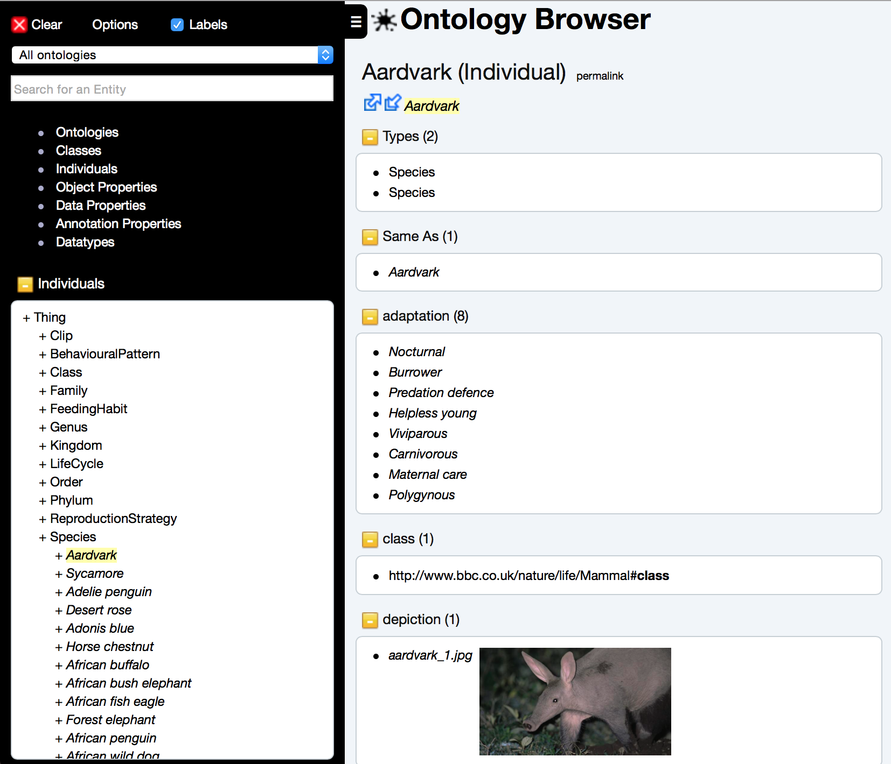

# Ontology Browser

A "fork" of the ontology browser from the [CO-ODE project](https://code.google.com/p/ontology-browser/).

Example running on Heroku:
https://ontology-browser.herokuapp.com/

## Aims
* Make it easily buildable - maven
* Make it easily runnable - jetty (local) heroku (remote)
* Have it running again for demo purposes
* Make it more scalable - sort out stupid config problems
* Extract all rendering into views - jsp? or maybe just go full blown Spring MVC
* Tests!!

## Run locally

Ontology Browser uses MongoDB to store permalink information.
MongoDB should be running on localhost on the default port before starting.

Using maven to build.
Some dependencies are local (in /repo) as they do not exist on any mvn repo.

`mvn clean package cargo:run`

## Deployment to Heroku

`git push heroku master`

Or from a dev branch

`git push heroku branchname:master`

See [Heroku instructions for Jetty](https://devcenter.heroku.com/articles/deploy-a-java-web-application-that-launches-with-jetty-runner).

### MongoDB

This can be added to Heroku by following these instructions:
https://devcenter.heroku.com/articles/mongolab

Ontology browser will automatically pick up the connection details from MONGOLAB_URI.
